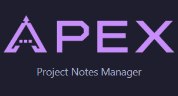

# Apex — Project Notes Manager

  ⚠️ WORK IN PROGRESS ⚠️

  

A standalone desktop application for managing project notes as plain Markdown files. Built for solo developers who want a visual, board-based overview of their notes without locking data into a proprietary format.

All notes are stored as `.md` files on disk — readable and editable by any text editor, version-control friendly, yours forever.

---

## 🌐 Live Demo

> **[▶ Open interactive board demo](https://ibl4st3r.github.io/Apex/ProjectSample.html)**

An exported Apex project — fully interactive in the browser.
Pan, zoom, click cards to read notes, explore relations between them.
No installation required.

## 📸 Overview

Apex gives you two ways to look at your notes:

- **Board view** — 2D canvas where each note is a draggable card. Pan, zoom, draw relations between cards, drop images, add title labels.
- **Structure view** — a classic file tree showing your folders and `.md` files, with multi-select and a side-by-side reader/editor.

Switch between views instantly. Both are always in sync.

---

## ✨ Features

### 📋 Board View
- Canvas with pan (drag background or middle mouse) and zoom (scroll wheel)
- Note cards show title, category badge, folder path, last modified date, and a live Markdown preview
- Three card sizes: **Minimum**, **Medium**, **Large** — plus free-form resize by dragging card edges
- Drag cards freely; positions are saved immediately to the `.apex` file
- **Lock cards** to prevent accidental movement
- **Right-click** context menu: new card, set category, set size, edit, delete, open in system editor, copy as template

### 🔗 Relations & Connections
- Draw **manual relations** between any two elements (notes, images, title cards) via right-click → Add relation
- Relations are rendered as curved arrows with adjustable color and thickness
- Drag the bend handle on each relation to reshape the curve
- **Wiki-link connections** — if note A contains `[[B]]`, it will create a warp to a B note.

### 🖼 Images & Titles on the Board
- Paste images directly from clipboard (`Ctrl+V`) — saved automatically to `.images/` in the project folder
- Add image files via right-click → New image
- Add **title cards** (decorative text labels) with full font/size/color/background control
- All board elements (notes, images, titles) support resize, lock, category assignment, and manual relations

### 📁 Structure View
- File tree of all `.md` files and folders in the project root
- Files with no board card are highlighted in red with a warning icon
- **Ctrl+click** / **Shift+click** for multi-select
- Multi-selected files are displayed merged into a single continuous read-only document
- Context menu per file/folder: open, rename, delete (Recycle Bin), find on board, copy as template, open in system editor
- "Open folder" button opens the project root in Windows Explorer

### ✏️ Note Editor
- Read mode renders full Markdown: headings, bold, italic, strikethrough, code blocks with syntax highlighting, tables, task lists, images, `[[wiki-links]]`
- Edit mode is a plain-text editor (raw Markdown)
- **Markdown toolbar** with buttons for headings, bold, italic, code, blockquote, lists, tables, links, images, wiki-links
- `[[link]]` autocomplete dropdown while typing
- Rename note by editing the title field in edit mode — file is renamed on disk automatically
- `Ctrl+S` to save, `Esc` to cancel, `F2` to enter edit mode
- External file change detection: banner appears if the file is modified by another app while editing

### 🏷 Categories
- Define custom categories with a name and a color (hex or preset palette)
- Assign one category per note
- Category badge shown on board cards, in the file tree, and in the note toolbar
- Manage via Settings (gear icon) — add, edit, delete, recolor

### 📝 Templates
- Save any note as a template (right-click → Copy as template, or from the board card menu)
- Templates stored in `.templates/` inside the project folder
- Each template can have a default category and a default target folder
- When creating a new note, pick a template from the New Note dialog — content is pre-filled, category and folder are applied automatically
- Manage templates via the clipboard icon in the toolbar

### 🔍 Search
- `Ctrl+F` or search icon in the toolbar
- Searches note filenames and relative paths
- Keyboard navigation: arrow keys to move through results, Enter to open, Escape to close
- Works in both Board and Structure view — navigates to the card or file accordingly

### 📤 HTML Export
- Export the entire project to a single self-contained HTML file
- The exported board is fully interactive: pan, zoom, click cards to read full content, toggle wiki-link connections
- Images are copied to a folder next to the HTML file
- Each card in the export has a "Copy MD" button to copy the raw Markdown

### 💾 Project File
- Each project is a folder with a single `.apex` file (JSON) at the root
- The `.apex` file stores: project name, last view, zoom level, card positions, categories, relations, title cards, image cards
- Note **content** lives only in `.md` files — the `.apex` file is safe to commit to Git alongside your notes
- Open a project by double-clicking the `.apex` file, or via the startup screen

---

## 🚀 Getting Started

1. Download the latest release and run `Apex.exe`
2. Click **Create new project** and select an empty folder
3. Enter a project name — Apex creates the `.apex` file and opens the board
4. Right-click the board → **New card** to create your first note

To open an existing project: double-click any `.apex` file, or use **Open existing project** on the startup screen. Recent projects are listed on the startup screen for quick access.

---

## ⌨️ Keyboard Shortcuts

| Shortcut | Action |
|---|---|
| `Ctrl+N` | New note (at viewport center) |
| `Ctrl+S` | Save note (edit mode) |
| `Ctrl+F` | Open search |
| `Ctrl+V` | Paste image or text from clipboard |
| `Ctrl+Home` | Fit all cards in view |
| `F2` | Enter edit mode |
| `Esc` | Cancel edit / close search |
| `Ctrl+Z` / `Ctrl+Y` | Undo / Redo (edit mode) |
| Mouse wheel | Zoom in/out on board |
| Middle mouse drag | Pan board |
| Left drag (background) | Pan board |

---

## 🛠 Technical Stack

- **Language:** C# (.NET 8)
- **UI:** WPF (Windows Presentation Foundation)
- **Markdown parsing:** [Markdig](https://github.com/xoofx/markdig)
- **Syntax highlighting:** [AvalonEdit](https://github.com/icsharpcode/AvalonEdit)
- **Serialization:** System.Text.Json
- **Target OS:** Windows 10 / Windows 11 (64-bit)
- No database. No network. No telemetry. All data stays on your disk.

---

## 📄 License

Released under the [GNU General Public License v3.0](LICENSE).